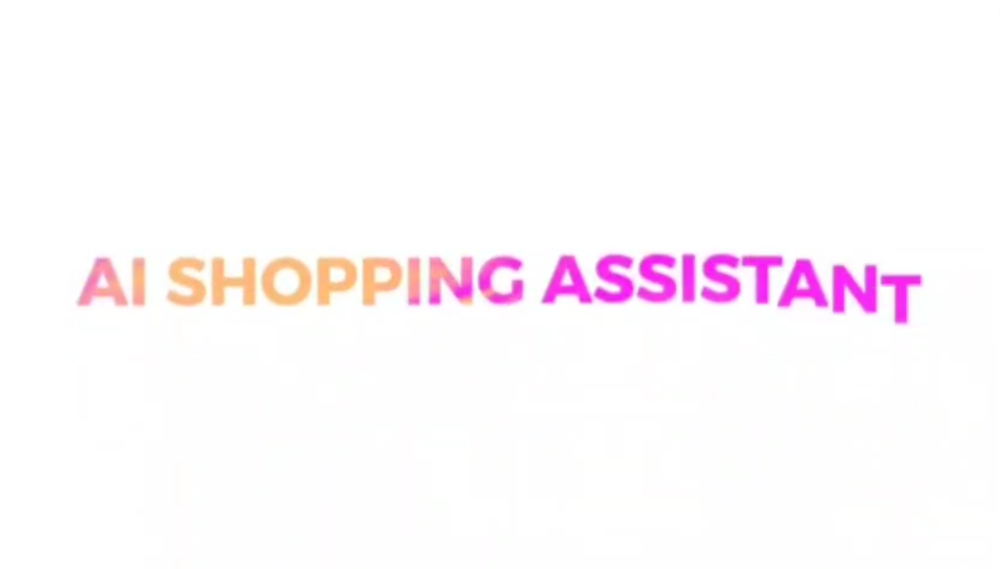

# Project Details

This project is an attempt at Theme-1 of the Appian AIgnite Hackathon, Round 2.  
It is an AI-Powered Personal Shopping Assistant for E-Commerce proof-of-concept on a footwear-only dataset.  

## Demo Trailer

# Setup Instructions

Please use a device running Windows  

Clone this repository:  
git clone https://github.com/Madhav-AK/AI-Shopping-Assistant/  

Download the zip file in the following link (This is the dataset we trained on):  
https://vision.cs.utexas.edu/projects/finegrained/utzap50k/ut-zap50k-images-square.zip  

Extract it and place it inside the same working directory where you cloned our repository and rename the extracted folder to 'shoes'  
If you did everything correctly, there should be 4 subfolders inside the 'shoes' folder with different kind of footwear.  

Run the python script shoes_init.py  
(This converts the shoes folder into the format we need for the app to run)  

Create a .env file and create an entry:  
GEMINI_API_KEY=(insert your api key here)  

Note that you can get a gemini api key for free at https://aistudio.google.com/app/apikey  
If there is any issue with getting Gemini running, please contact the team.  

Install all the dependencies in requirements.txt  

Run app.py  
